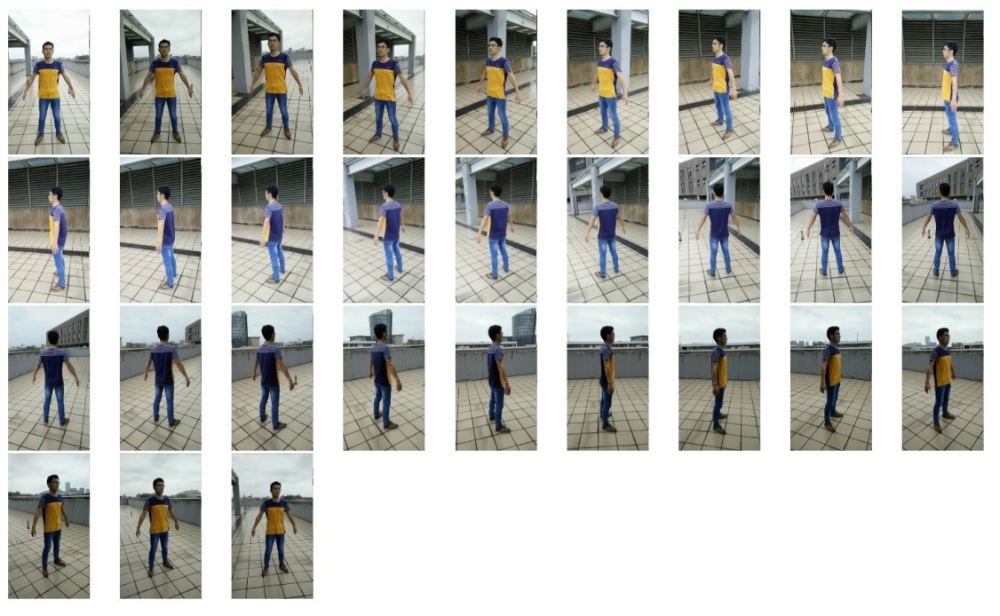

# 3D-model-reconstruction-from-image-sequence

This is my undergraduate design project

Bascially it's a 3D reconstruction software, by inputting a image sequence photoed around the real object you want to reconstruct, then you delete redudent noise points by Perl script and finally you get a .ply 3D model file.

I complete this project on my Ubuntu virtural machine and I use a lot of existing libraries or softwares  to solve some difficult parts in 3D reconstruction process. They are basically :

- Dependency Packages : libgtk2.0-dev、libglew1.6-dev、libglew1.6、libdevil-dev、 libboost-all-dev、libatlas-cpp-0.6-dev、libatlas-dev、imagemagick、libatlas3gf-based、libcminpack-dev、libgfortran3、libmetis-edf-dev、libparmetis-dev、freeglut-dev、libgslo-dev.
You can install them by this command in Terminal : $ sudo apt-get install libgtk2.0-dev libglew1.6-dev libglew1.6 libdevil-dev libboost-all-dev libatlas-cpp-0.6-dev libatlas-dev imagemagick libatlas3gf-base libcminpack-dev libgfortran3 libmetis-edf-dev libparmetis-dev freeglut3-dev libgsl0-dev

- VisualSFM : You can refer to here http://ccwu.me/vsfm/index.html for more information

- SiftGPU : You can refer to here http://cs.unc.edu/~ccwu/siftgpu/ for more information

- Multicore Bundle Adjustment(a.k.a.“pba”) : You can download here http://grail.cs.washington.edu/projects/mcba/

- PMVS-2 : You can download here http://www.di.ens.fr/pmvs/pmvs-2.tar.gz

- Graclus 1.2 : You can download here http://www.cs.utexas.edu/users/dml/Software/graclus.html

- CMVS : You can download here http://www.di.ens.fr/cmvs/cmvs-fix2.tar.gz

- MeshLab : Use it to delete noise points we don't want

You can find more detail reference here http://www.10flow.com/2012/08/15/building-visualsfm-on-ubuntu-12-04-precise-pangolin-desktop-64-bit/ to know how to set up these things in your OS.

My IDE : QT Creator 3.6.0 based on QT 5.5.1 (GCC 4.9.1 20140922(Red Hat 4.9.1-10), 64bit)

If you're interested in it, you can contact me HanmingZhang@hotmail.com :)

Screenshots : 
------------------------

Basic GUI : 

Figure Test Sample (30 images) :

Result :

Bottle Test Sample (24 images) :

Result :

Apple Test Sample (66 images) :

Result :

Sculpture Test Sample (40 images) :

Result :

